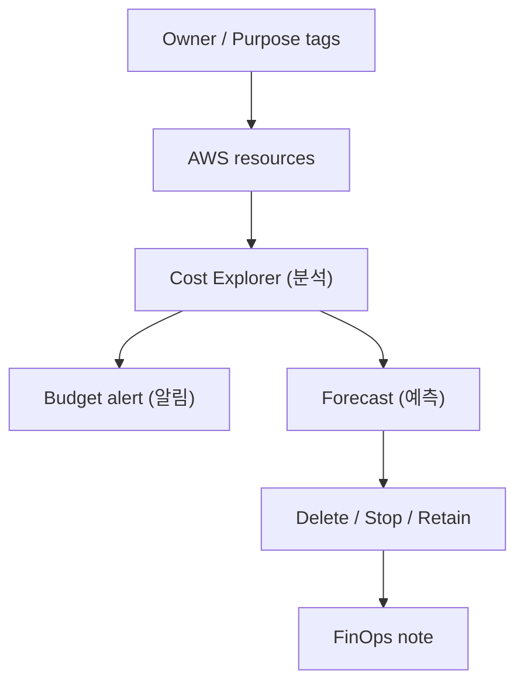

# 4교시: FinOps review

## 실습 확인 기록

| 명령/확인 | 결과 |
|---|---|
| | |

## 확인 질문 답변

| 질문 | 답변 |
|---|---|
| FinOps review란? | 비용을 **아끼자는 구호가 아니라** 비용의 **원인을 설명 가능하게** 만드는 절차. 작은 비용도 **service·owner·purpose**로 추적하고, 마지막은 **삭제/중지/유지** 중 하나로 판단을 남김 |
| Budget·Cost Explorer·Forecast는 각각 뭐하나? | **Budget**=임계값 **알림**(막지 않음). **Cost Explorer**=과거 비용 **분석**. **Forecast**=추세 기반 **미래 비용 예측**. 셋 다 **삭제를 안 함** → cleanup은 별도 판단 |
| forecast는 무엇을 근거로 하나? | 과거 사용 **추세**로 이번 달/다음 구간 **예상 비용**을 계산. "지금 이대로면 월말에 얼마"를 미리 봄 → 임계 초과 전에 조치. 단 **추정치**(사용 패턴 바뀌면 빗나감) |
| 비용이 어디서 났는지 어떻게 답하나? | **Cost Explorer service filter**(어느 서비스) + **resource inventory**(어느 resource) + **Owner tag**(누구 것)를 **비교**. "S3가 비싸다"가 아니라 "누구의 어떤 bucket이" 수준까지 |
| 왜 owner tag가 중요한가? | tag 없으면 비용 그래프가 있어도 **주인을 못 찾아** 삭제 판단 불가. `Owner/Purpose`로 묶여야 "이건 누구 실습, 지워도 되나"를 답함. tag는 **생성 시점에**(day4: 활성화·backfill 한계) |
| cleanup 판단은 어떻게 남기나? | **삭제/중지/유지 중 하나 + 사유 + 다음 확인 시각**. "유지"도 방치가 아니라 **사유·예상 비용·삭제 예정일**을 적은 결정. `확인한 값→판단→다음 행동` |
| 삭제와 중지(stop)는 어떻게 다른가? | **stop**은 compute만 멈추고 **storage·snapshot·EIP는 계속 과금**. 특히 **RDS stop은 최대 7일 후 자동 재기동**(day4). 장기 미사용이면 **snapshot 남기고 삭제**가 비용상 맞음 |

## notes

- **한 줄 요약**: FinOps review는 비용 그래프를 보는 일이 아니라 **비용 원인과 다음 조치를 연결**하는 일
- **핵심**: 비용을 아끼자는 구호가 아니라 **원인을 설명 가능하게** 만드는 절차. 작은 비용도 **owner·purpose·service**로 추적하고, 마지막 판단은 **삭제/중지/보존 중 하나**로 남긴다
- **구조로 보기**:

- **Budget vs Cost Explorer vs Forecast (역할 구분)**:
  | 도구 | 시점 | 답하는 것 | 삭제/차단 |
  |---|---|---|---|
  | **Cost Explorer** | 과거 | **얼마 썼나**(service/tag) | **안 함** |
  | **Forecast** | 미래 | **얼마 쓸 것 같나**(추세 예측) | 안 함 |
  | **Budget** | 임계 | **넘었나/넘을까**(알림) | **안 함**(Action 별도) |
  - 공통: **셋 다 resource를 안 지운다.** 비용을 멈추는 건 항상 **직접 cleanup**.
- **forecast = 초과 전에 미리 보기**: 과거 사용 추세로 **월말 예상 비용**을 계산 → "이대로면 임계 넘겠다"를 **초과 전에** 조치. 단 **추정치**라 사용 패턴이 바뀌면 빗나감(신규 resource·트래픽 급증). Budget과 짝: forecast로 예측, Budget으로 알림
- **owner attribution = tag 없으면 판단 불가**: 비용 그래프가 있어도 **주인을 모르면** 삭제·유지 결정을 못 함. `Owner/Purpose` tag로 "누구의 무슨 용도"까지 좁혀야 cleanup 가능. tag는 **생성 시점에**(day4: 활성화 필요·backfill은 활성화 지연만 완화, untagged는 소급 불가)
- **cleanup decision table = 삭제/중지/유지 (사유 필수)**:
  | resource | 판단 | 사유 | 다음 확인 |
  |---|---|---|---|
  | (예) unattached EIP | **삭제** | 안 붙어 과금만 | 즉시 |
  | (예) RDS 실습 DB | **삭제 + final snapshot** | 재사용 없음, 복구지점만 | snapshot 비용 월말 |
  | (예) 공용 bucket | **유지** | 팀 공유 자료 | Day6 재점검 |
  - "유지"도 **방치 ≠ 결정**: 사유·예상 비용·삭제 예정일을 적어야 진짜 판단.
- **삭제 vs 중지(stop) 판단**: stop은 **compute만** 멈춤 → **storage·snapshot·EIP·backup은 계속 과금**. **RDS stop은 최대 7일 후 자동 재기동**(모르게 재과금, day4-05). 장기 미사용이면 **snapshot 남기고 삭제**가 정답, stop은 **며칠 내 재사용**할 때만
- **비용 질문 답 형식 = service · owner · action**: "비용이 왜?"에 **어느 service(CE) + 누구 것(tag) + 무슨 조치(delete/stop/retain)**로 답. 그래프 캡처가 아니라 이 3요소가 evidence
- **잔여 비용 후보는 day4-07 checklist 재사용**: 상시(ALB·NAT·EIP·running RDS) / 저장(EBS·snapshot·version·log). ⑥~⑪이 그 inventory. **상시 과금부터** 정리
- 흔한 실패 3개:
  - ① **Cost Explorer 지연(~24h)을 모름**(그날 만든 비용이 안 보여 "없다"고 오판 → 다음 날 재확인)
  - ② **tag 누락**(비용 주인을 못 찾아 cleanup 판단 불가)
  - ③ **snapshot/log/ALB 비용 후보 누락**("instance 지웠으니 끝" 착각)

## Blocker Log

| 증상 | 확인한 것 |
|---|---|
| | |
