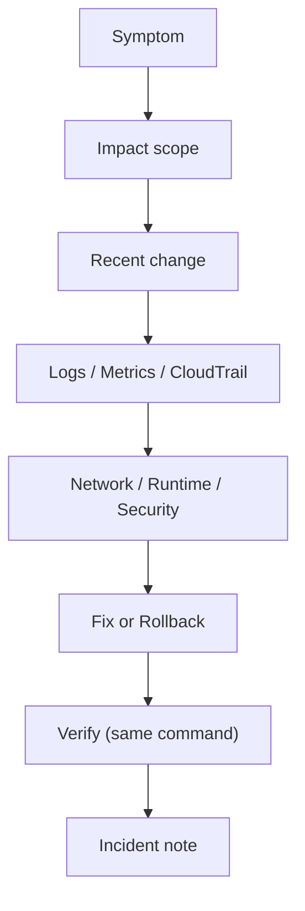

# 5교시: 장애 분석 drill

## 실습 확인 기록

| 명령/확인 | 결과 |
|---|---|
| | |

## 확인 질문 답변

| 질문 | 답변 |
|---|---|
| 장애 분석의 첫 단계는? | **원인 추정이 아니라** 사용자가 보는 **증상(symptom)을 구체화**하는 것. "느리다"가 아니라 **HTTP status·timeout·error 메시지**로. 그다음 영향 **범위(scope)**를 고정 |
| 왜 원인부터 단정하면 안 되나? | 첫 추측이 틀리면 **엉뚱한 곳만 파다** 시간 낭비. symptom→scope→change→evidence를 **순서대로 채워야** 원인 후보가 좁혀짐. 추측 게임이 아니라 절차 |
| scope(영향 범위)를 왜 먼저 정하나? | **전체 장애인지 내 환경 문제인지** 구분해야 함. 특정 user/Region/service만인가, 전부인가 → 범위가 다르면 보는 evidence·긴급도가 달라짐 |
| 최근 변경은 어떻게 활용하나? | **변경 시각(CloudTrail/배포 이력) vs 증상 시각**을 비교. 변경 직후 증상 시작이면 그 변경이 **1순위 원인 후보** → rollback 검토. 변경 없으면 외부·부하 쪽 |
| 어느 경계에서 문제인지 어떻게 좁히나? | network(SG)·runtime(task/health)·security(권한)·data(DB)·cost 중 **증상에 맞는 것**부터. 5xx면 runtime/health, AccessDenied면 IAM/권한, timeout이면 SG/network |
| 조치 후 무엇을 하나? | **실패를 확인했던 같은 명령/화면으로 재확인(verify)**. ①로 5xx를 봤으면 조치 후 ①을 다시 → 200 확인. "고친 것 같다"가 아니라 **같은 기준의 재확인 결과**가 증거 |
| rollback 기준은 무엇인가? | 감이 아니라 **변경 전 evidence**(image tag·task def revision·target healthy·curl 200). 그 상태로 되돌리는 게 rollback → 변경 전 evidence가 없으면 rollback 기준도 없음(day3) |

## notes

- **한 줄 요약**: 장애 분석은 빠른 추측보다 **증상과 evidence를 분리해 같은 기준으로 재확인**하는 절차
- **핵심**: 추측 게임이 아니다. **symptom → scope → recent change → evidence → boundary → action → verify** 순서를 밟고, 조치했으면 **실패를 봤던 같은 명령/화면으로 재확인**
- **구조로 보기**:

- **7단계 drill (각 단계의 질문·화면)**:
  | 단계 | 질문 | 화면/명령 |
  |---|---|---|
  | **Symptom** | 사용자가 뭘 보나 | HTTP status·timeout·error(①) |
  | **Scope** | 어디까지 영향인가 | target health·user/Region 범위(②) |
  | **Recent change** | 최근 뭐가 바뀌었나 | CloudTrail·배포 이력(③) |
  | **Evidence** | 규모·원인은 | Metrics(④)·Logs(⑤) |
  | **Boundary** | 어느 경계 문제인가 | runtime(⑥)·network SG(⑦) |
  | **Action** | 고칠까 되돌릴까 | fix / rollback(⑧) |
  | **Verify** | 정말 나았나 | **같은 명령 재확인**(⑨⑩) |
- **symptom은 구체적으로**: "느리다/안 된다"가 아니라 **`503`, `timeout 30s`, `AccessDenied`** 수준으로. 모호한 증상은 evidence를 못 고름. 사용자 문장을 **관측 가능한 값**으로 번역하는 게 1단계
- **scope = 전체 vs 개인 구분**: 나만 안 되나(내 캐시·IP·권한) vs 모두 안 되나(service 장애). 범위를 안 정하면 **개인 환경 문제를 전체 장애로** 오인해 과잉 대응
- **recent change = 변경 시각 vs 증상 시각**: 대부분의 장애는 **직전 변경**과 관련. CloudTrail·배포 이력에서 "언제 뭐가 바뀌었나"를 증상 시작 시각과 나란히 → 겹치면 그 변경이 원인 후보(day5-02와 같은 사고)
- **증상 → 첫 evidence 매핑 (시나리오)**:
  | 증상 | 먼저 볼 곳 | 흔한 원인 |
  |---|---|---|
  | **ALB 5xx** | target health·app log·ECS events | task crash·port·health path 불일치 |
  | **container unhealthy** | ECS service events·task log | 이미지 pull·포트·health check 실패 |
  | **S3 AccessDenied** | IAM policy·bucket policy·BPA | 권한 부족·public 차단(정상일 수도) |
  | **비용 급증** | Cost Explorer·resource inventory | 안 지운 ALB/NAT/RDS·snapshot |
- **verify = 같은 명령으로 (drill의 핵심)**: 조치 전 실패를 확인한 **바로 그 명령/화면**으로 재확인. ①(curl 503)→⑩(curl 200), ②(unhealthy)→⑨(healthy). 다른 방법으로 "된 것 같다"는 증거가 아님 → **같은 기준의 before/after**
- **rollback 기준 = 변경 전 evidence**: "감으로 되돌리기"가 아니라 **`image=v1, task def rev=3, target=healthy, curl=200`** 같은 정상 상태 기록으로 복귀. 변경 전 evidence를 안 남겼으면 **되돌릴 기준 자체가 없음**(day3 rollback preview)
- **incident note 형식**: symptom·scope 기록 + recent change evidence + verify result를 한 세트로. `확인한 값 → 판단 → 다음 행동`, 마지막에 **rollback/cleanup 상태**까지
- 흔한 실패 3개:
  - ① **원인 단정**(첫 추측에 매달려 엉뚱한 곳만 팜 → 순서대로 채우기)
  - ② **재확인 누락**("고친 것 같다"로 종료 → 같은 명령 재확인)
  - ③ **rollback 기준 없음**(변경 전 정상 evidence를 안 남겨 되돌릴 기준 부재)

## Blocker Log

| 증상 | 확인한 것 |
|---|---|
| | |
