# 2교시: Write–Plan–Apply를 직접 한 바퀴 돌아보기

```bash
# 실습 변수 (파일 상단에서 한 번만 export)
export LAB=~/KTCLOUD/cloud-native-devops-2026/week_over/terraform/day1/labs/cli-lifecycle
```

## 실습 확인 기록

| 명령/확인 | 결과 |
|---|---|
| ① `terraform version` | `Terraform v1.15.8 on darwin_arm64` |
| ② `uname -s` | `Darwin` |
| ③ `uname -m` | `arm64` |
| ④ `printf '%s\n' "$SHELL"` | `/bin/zsh` |
| ⑤ `cd $LAB && pwd` | mac@macui-MacBookPro ~ % cd $LAB && pwd `/Users/mac/KTCLOUD/cloud-native-devops-2026/week_over/terraform/day1/labs/cli-lifecycle` |
| ⑥ `ls -la $LAB` | `total 32  drwxr-xr-x  6 mac  staff  192 Jul 13 09:13 . drwxr-xr-x  3 mac  staff   96 Jul 13 09:13 .. -rw-r--r--  1 mac  staff  173 Jul 13 09:13 .gitignore -rw-r--r--  1 mac  staff  351 Jul 13 09:13 evidence-template.md -rw-r--r--  1 mac  staff  559 Jul 13 09:13 main.tf -rw-r--r--  1 mac  staff  160 Jul 13 09:13 outputs.tf` |
| ⑦ `terraform fmt -check -diff` (종료코드 0 = 통과) | |
| ⑧ `terraform init` (성공 메시지 / `.terraform/` 생성) | 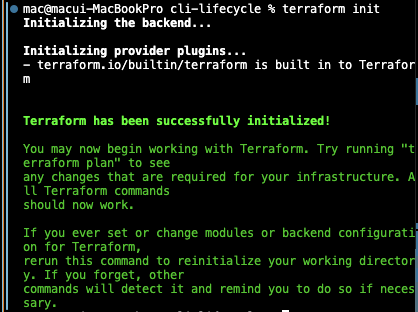 |
| ⑨ `terraform validate` (`Success! The configuration is valid.`) | 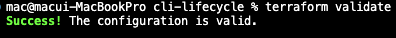 |
| ⑩ `terraform plan -out=tfplan` (`Plan: 1 to add, 0 to change, 0 to destroy.`) | 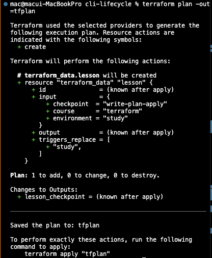 |
| ⑪ `terraform show tfplan` (사람이 읽는 형태) | 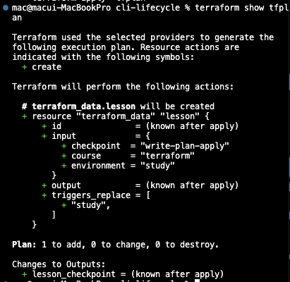 |
| ⑫ `terraform apply tfplan` | 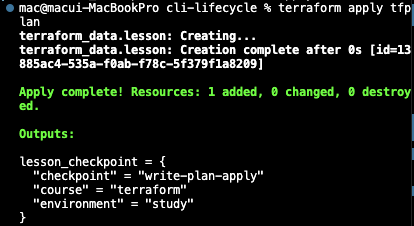 |
| ⑬ `terraform output` | 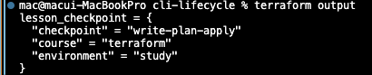 |
| ⑭ `terraform state list` (`terraform_data.lesson`) | 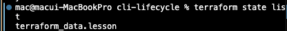 |
| ⑮ `terraform state show terraform_data.lesson` (input/output/id) | 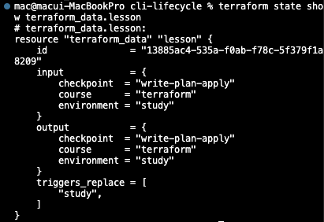 |
| ⑯ `terraform plan` (재실행 → `No changes.`) | 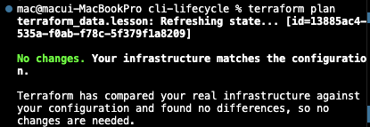 |
| ⑰ `terraform plan -var='environment=practice'` (교체 계획, 적용 안 함) | 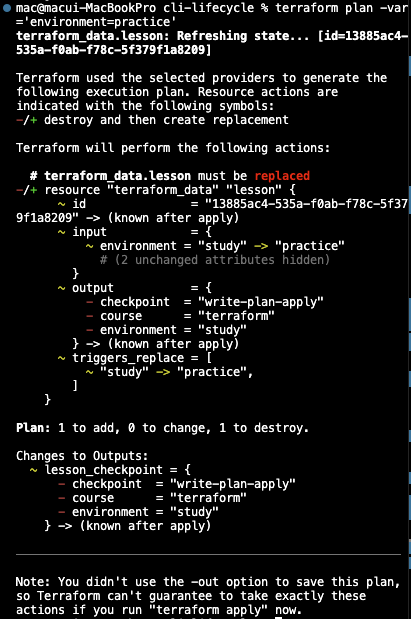 |
| ⑱ `terraform destroy` (`0 to add, 0 to change, 1 to destroy`) | 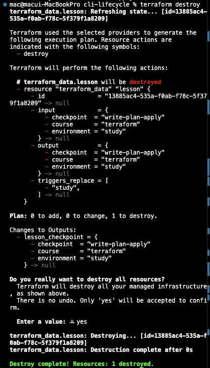 |
| ⑲ `terraform state list` (비어 있어야 함) | |
| ⑳ `terraform plan` (destroy 후에도 다시 생성 계획 나옴) | 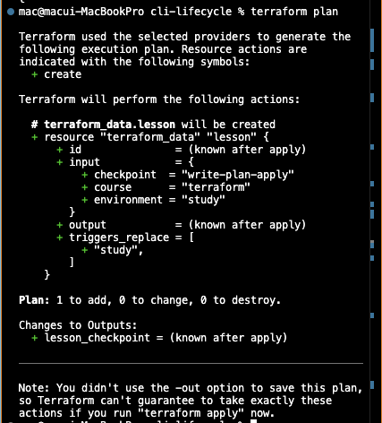 |
| ㉑ `rm -f $LAB/tfplan` | |

### 일부러 실패시켜 보기 (선택)

| 명령/확인 | 결과 |
|---|---|
| `main.tf`의 `var.environment` → `var.enviroment`(오타)로 바꾸고 `terraform validate` → 오류의 파일·줄·변수명 확인 후 복구 | |

## 확인 질문 답변

| 질문 | 답변 |
|---|---|
| `fmt`가 통과하면 Configuration이 유효한가? | 아니다. 형식(들여쓰기·정렬)만 확인. 의미 검증은 `validate`, 변경 안전성은 `plan`이 담당. |
| `validate`가 성공하면 AWS 리소스 생성도 가능한가? | 아니다. 구문·내부 참조 일관성만 확인. 원격 권한·비용·실제 실행 맥락은 보장 안 함. |
| 저장 Plan(`tfplan`)은 Git에 올려도 되나? | 안 된다. 민감정보 포함 가능한 바이너리라 `.gitignore` 제외, 실습 후 삭제. |
| `destroy` 뒤 Configuration도 사라지나? | 아니다. `.tf`는 남고 다음 `plan`은 다시 생성을 제안. destroy는 코드가 아니라 실제 객체를 제거하는 별도 작업. |
| 첫 apply 성공이 재현성의 증거인가? | 아니다. 같은 입력의 2번째 `plan`(No changes)과 환경·버전 기록이 더 필요. |

## notes

**오늘의 핵심**: 이번 실습은 외부 Provider·AWS 리소스를 만들지 않는다. Terraform 내장 `terraform_data` 리소스로 Configuration → Plan → State 흐름만 분리해 관찰한다. 비용·인증 문제 없이 CLI 수명주기를 보는 게 목적.

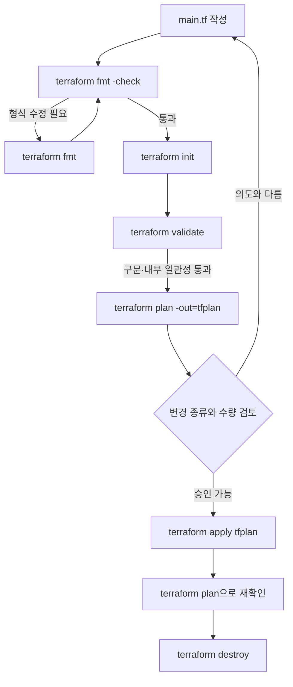

**명령은 각각 다른 질문을 한다 (답하는 것 / 못 하는 것)**
- `terraform fmt -check` — 표준 형식과 다른 파일 있나? / 의미상 안전한가는 모름
- `terraform init` — 이 작업 디렉터리 쓸 준비 됐나(Backend·Provider·Module)? / 변경이 의도와 맞나는 모름
- `terraform validate` — 구문·내부 참조 일관적인가? / 원격 권한·비용·정책은 모름
- `terraform plan` — 현재 입력·State에서 뭐가 바뀌나? / 사업적 승인 여부는 모름
- `terraform apply` — 승인된 작업 실행? / 운영 목표 충족은 모름
- `terraform show` — Plan·State에 어떤 값 있나? / 서비스 건강 여부는 모름

**Plan 기호 읽는 법** (요약 숫자만 보지 말고 Resource 주소 + attribute 같이)
- `+` 생성 → 이름·Region·비용·수량 맞나?
- `~` 제자리 수정 → 중단·정책 변경 생기나?
- `-/+` 또는 `+/-` 교체 → 데이터·endpoint·downtime 영향?
- `-` 삭제 → 백업·보호 정책·승인자 확인했나?
- `(known after apply)` → 어떤 의존성 때문에 지금 모르는 값인가?

**멱등성 관찰**: 첫 apply 후 `plan` 재실행 시 `No changes.` = 멱등성의 첫 증거. 단 Provider 동작·외부 변경·시간 의존 입력이 있으면 영원히 보장되진 않음.

**교체(replace) 관찰**: `main.tf`의 `triggers_replace = [var.environment]` 때문에 `environment` 값이 바뀌면 `terraform_data.lesson`이 교체됨. Plan에서 관찰할 것 — 같은 Resource 주소 유지되는가 / 어떤 attribute가 교체 유발하는가 / destroy·create 중 뭐가 먼저인가 / 실제 DB였다면 승인 가능한가.

**destroy의 의미**: `destroy`는 코드를 지우는 게 아니라 현재 Configuration이 관리하던 실제 객체를 제거하는 별도 작업. 그래서 destroy 후 `state list`는 비지만 `plan`은 다시 생성을 제안한다. 이 차이가 핵심.

**Git에 무엇을 남길까**
| 항목 | Git | 이유 |
|---|---|---|
| `*.tf` | 포함 | 원하는 상태·입력 인터페이스 리뷰 |
| `.terraform.lock.hcl` | 포함 | Provider 버전·checksum 재현 (공식 권장) |
| `.terraform/` | 제외 | 다운로드 plugin·로컬 Backend 캐시 |
| `*.tfstate*` | 제외 | 민감 속성·실제 객체 identity 포함 |
| `tfplan`, `*.tfplan` | 제외 | 저장 Plan에 민감값 포함 가능 |
| `*.tfvars` | 상황별 | 실제 Secret 있으면 제외, example만 공유 |

**실패 기록 형식** — "안 됨"만 적지 말 것: 명령 / 종료코드 / 첫 오류 문장 / 영향받은 Resource 주소 / 변경 전 Plan 요약 / 확인한 파일·줄 / 수정 내용 / 재실행 명령·결과 / 남은 위험.

**공식 문서** — CLI commands, init, validate, Core workflow, Dependency lock file. (`validate`가 확인 안 하는 범위, lock file을 버전 관리하는 이유를 자기 말로 한 줄씩.)

## Blocker Log

| 증상 | 확인한 것 |
|---|---|
| `brew install terraform` → `No available formula`, 이후 `terraform: command not found` | Homebrew 코어에서 terraform 제거됨(2021년 HashiCorp가 라이선스를 MPL→BSL로 변경). 공식 tap으로 설치: `brew tap hashicorp/tap` → `brew install hashicorp/tap/terraform` → `terraform version`으로 확인 |
