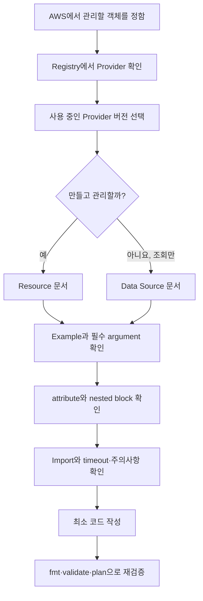

# 3교시: 처음 보는 Terraform 오브젝트를 공식 문서에서 찾는 법

## 실습 확인 기록

> 수업 시간이 부족하여 실습을 행하지 못했음. 추후 해보고 싶으면 강의자료를 참고해서 진행.

| 명령/확인 | 결과 |
|---|---|
| | |

## 확인 질문 답변

| 질문 | 답변 |
|---|---|
| Registry 검색 첫 결과가 공식 Provider라고 단정해도 되나? | 아니다. 상위 결과에 같은 이름의 비공식 Provider가 있을 수 있다. namespace(`hashicorp/aws`)·source 주소·official/verified 배지를 직접 확인해야 한다. |
| Example Usage에 없으면 필요 없는 설정인가? | 아니다. Example은 최소 입문 형태다. Tag·암호화·로깅·정책 등 운영 필수 설정이 생략됐을 수 있으니 Argument Reference 전체를 봐야 한다. |
| Data Source로 조회한 객체를 Terraform이 삭제할 수 있나? | 없다. Data Source는 읽기만 하고 수명주기를 소유하지 않는다. destroy 대상이 아니며, 삭제하려면 Resource로 관리(+Import)해야 한다. |
| `id`가 Attribute Reference에 있으니 Configuration에서 임의로 넣어도 되나? | 아니다. `id`는 apply 뒤 Provider가 반환하는 computed 값(읽기용)이라 입력 argument가 아니다. 넣으면 `Unsupported argument`나 소유권 혼동이 생긴다. 기존 객체 편입은 Import로 한다. |
| 최신 문서만 보면 기존 프로젝트의 Provider 동작도 정확히 알 수 있나? | 아니다. 문서는 릴리스 버전과 함께 바뀐다. 기존 프로젝트가 `.terraform.lock.hcl`에 고정한 버전의 문서를 봐야 한다. 최신 argument·기본값·deprecated를 옛 버전에 섞으면 어긋난다. |

## notes

**오늘의 핵심**: 코드를 외우지 않는다. 처음 보는 리소스를 만났을 때 *맞는 Provider 버전의 공식 문서*에서 입력·출력·identity·위험을 꺼내 설계 메모로 옮기는 순서를 연습한다. 검색은 입구일 뿐, 최종 근거는 선택한 Provider 버전 문서다.

**검색에서 코드까지 가는 경로**: 위에서 아래로 읽으며 `만들 것인가, 읽을 것인가`에서 경로가 갈리는 것을 본다. Example Usage를 복사한 뒤 끝내지 않고, schema와 Import까지 확인한 다음 로컬 검증(fmt·validate·plan)으로 돌아온다.

**문서는 두 군데를 오간다**
- Terraform 문법·Workflow (`resource` 블록, `for_each` 제약, reference) → HashiCorp Developer / Terraform Language
- AWS 객체(`aws_vpc`가 받는 값, Import ID) → Terraform Registry의 `hashicorp/aws` Provider 문서
- 섞어 읽으면 책임 경계가 흐려진다. Terraform Core는 CIDR 규칙을 정하지 않는다 — 그 스키마·API 연결은 AWS Provider 몫.

**Provider 신원을 코드보다 먼저 적는다**: display name / namespace·name / source address / 선택 version / 연결된 release / 공식·검증 근거 / 확인 날짜. `hashicorp/aws`에서 `hashicorp`=namespace, `aws`=이름. 버전 숫자를 영구 정답으로 외우지 않는 이유 → Provider는 계속 릴리스됨. 프로젝트는 `required_providers`에 지원 범위만 선언하고, `init`이 고른 정확한 버전·checksum은 `.terraform.lock.hcl`에서 리뷰한다.

**Resource vs Data Source** (초반에 자주 섞임)
- `resource "aws_vpc" "main"` = 관리 대상. 생성·수정·삭제 수명주기를 소유.
- `data "aws_vpc" "selected"` = 조회 객체. 외부 정보를 읽지만 소유하지 않음.
- 새로 만들고 책임 → Resource / 다른 팀 기존 객체 읽기 → Data Source / Console에서 만든 걸 이제 관리 → Resource + Import.
- Data Source도 만능 아님: 이름·Tag 모호하면 엉뚱한 후보를 고를 수 있음 → Plan에서 확인.

**Resource 문서 읽는 순서**: ① 설명·Example Usage(최소 형태만, 운영 코드로 착각 금지) ② Argument Reference/Schema(Required/Optional/Computed) ③ Attribute Reference(다른 블록이 참조할 값, `aws_vpc.main.id` → subnet의 `vpc_id`, 암묵적 의존성의 근거) ④ Import·identity(Day5에서 사용) ⑤ 주의사항·Timeout·별도 가이드(예전엔 한 Resource였던 게 지금은 분리됐을 수 있음).

**Argument ≠ Attribute**: argument는 내가 *넣는* 입력, attribute는 Provider가 apply 뒤 *알려주는* 읽기값(computed). computed를 설정하려 하거나 필수 입력을 빠뜨리는 게 흔한 실수. 실습 ⑨~⑫에서 `providers schema -json`으로 `required`/`optional`/`computed` 플래그를 직접 확인한다.

**AWS 이름을 바로 번역하지 말 것**: Console 한 화면 = Terraform Resource 하나가 아닐 수 있다. VPC의 flow log·endpoint, S3의 versioning·encryption·public access는 별도 Resource로 분리됐을 수 있음. 표의 Resource 이름은 탐색 출발점일 뿐, 코드 작성 시 선택한 버전 문서를 다시 확인.

**AI 답변 검증**: type이 현재 버전에 있나(Registry URL) / argument 이름·타입 맞나(Schema) / 입력인가 computed인가 / 변경 시 교체·삭제 생기나(Plan) / deprecated인가(upgrade guide) / Import ID 형식 맞나. 출처를 물어보는 걸로 끝내지 말고 링크를 직접 열어 namespace·version·항목을 확인.

**자주 나오는 실패**
- `Unsupported argument` → 다른 버전/다른 Resource 예제를 봄 → 선택한 버전 schema 확인
- `Reference to undeclared resource` → block label·주소가 다름
- Data Source가 후보 못 찾음 → Region·filter·Tag 다름
- 계획에 예상 못한 새 Resource → 조회할 걸 `resource`로 선언함 (`resource`/`data` block type 확인)
- Import가 ID 해석 실패 → 다른 Resource의 ID 형식 사용

**Evidence 수준**: 0 = 블로그/AI 코드만, source·version·URL 없음 / 1 = 공식 문서는 찾았으나 argument·attribute·Import·위험 분석 누락 / 2 = 버전 고정된 공식 문서에서 Resource·Data Source, 입출력, identity, 위험을 찾아 설계와 연결.

**공식 문서**
- Terraform Language: https://developer.hashicorp.com/terraform/language
- Provider docs format: https://developer.hashicorp.com/terraform/registry/providers/docs
- Data Sources: https://developer.hashicorp.com/terraform/language/data-sources
- Terraform Registry: https://registry.terraform.io/

## Blocker Log

| 증상 | 확인한 것 |
|---|---|
| | |
