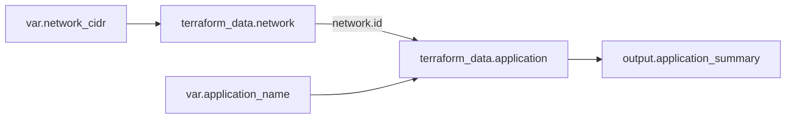

# 4교시: 블록, 주소, 참조와 의존성을 한 장으로 읽기

## 실습 확인 기록

> 수업 시간이 부족하여 실습을 행하지 못했음. 추후 해보고 싶으면 강의자료를 참고해서 진행.

| 명령/확인 | 결과 |
|---|---|
| | |

## 확인 질문 답변

| 질문 | 답변 |
|---|---|
| `main.tf`가 항상 먼저 실행되나? | 아니다. 같은 디렉터리의 `.tf`는 하나의 Module로 합쳐진다. 파일 순서가 아니라 값 참조가 실행 순서를 만든다. |
| Resource label(`"main"`)은 AWS의 실제 이름인가? | 아니다. Configuration 안에서만 쓰는 local name이다. 실제 클라우드 이름은 `tags`·`name` argument 등으로 따로 정한다. |
| Data Source도 State에 보이니 수명주기를 관리하나? | 아니다. 조회 결과를 State에 기록할 뿐, 원격 객체를 생성·수정·삭제하지 않는다. |
| Module 내부 Resource를 호출자가 직접 참조하나? | 아니다. 호출자의 공개 인터페이스는 output이다. State에서 `module.network.aws_vpc.main`이 보이는 것과 Configuration에서 직접 접근은 다르다. |
| `depends_on`을 많이 쓰면 더 안전한가? | 아니다. 불필요한 순차화로 그래프가 보수적이 되고 unknown 범위가 넓어진다. 가능하면 값 참조로 관계를 드러내고, 숨은 관계만 제한적으로 쓴다. |

## notes

**오늘의 핵심**: Terraform은 파일의 위아래 순서를 실행 순서로 쓰지 않는다. **값의 참조**가 실행 순서를 만든다. 블록을 외우는 대신 각 객체의 *주소*와 *데이터 흐름*을 추적한다. `main.tf` 위에 VPC, 아래에 Subnet을 써도, Subnet이 `aws_vpc.main.id`를 참조하기 때문에 VPC가 먼저 만들어진다.

**HCL 문장 해부** — `resource "aws_vpc" "main" { cidr_block = var.vpc_cidr }`
| 조각 | 이름 | 역할 |
|---|---|---|
| `resource` | block type | 관리 Resource 선언 |
| `"aws_vpc"` | 첫 label | Provider가 정의한 Resource type |
| `"main"` | 둘째 label | Configuration 안의 local name |
| `{ ... }` | block body | argument·nested block |
| `cidr_block` | argument name | schema가 받는 입력 이름 |
| `var.vpc_cidr` | expression | 다른 named value 참조해 값 계산 |

Block은 구조를, argument는 이름에 값을, expression은 값을 계산한다. Provider가 Resource별 허용 argument·nested block을 정한다.

**주요 블록 역할·주소** — `terraform`(CLI·Provider requirement·Backend / 참조 안 함) · `provider`(Region·인증 / `aws`, `aws.secondary`) · `resource`(수명주기 관리 / `aws_vpc.main.id`) · `data`(읽기 / `data.aws_ami.selected.id`) · `variable`(`var.vpc_cidr`) · `locals`(`local.common_tags`) · `output`(`module.network.vpc_id`) · `module`(`module.network`) · `import`(`to = aws_vpc.main`) · `moved`(from/to). 같은 디렉터리 `.tf`는 하나의 Module로 합쳐진다 — `network.tf` → `compute.tf` 순서 실행이 아니다.

**주소 = 객체를 찾는 좌표** (왼쪽부터 읽기)
- `aws_vpc.main` — root module의 `aws_vpc` type, `main` 이름 Resource
- `aws_vpc.main.id` — 그 Resource의 `id` attribute 참조
- `aws_subnet.public[0]` — `count`로 만든 첫 instance / `aws_subnet.public["a"]` — `for_each` key `a` instance
- `module.network.aws_vpc.main` — State 관점의 Module 내부 VPC / `module.network.vpc_id` — 호출자에게 공개된 output
- 주의: Module 내부 Resource를 `module.network.aws_vpc.main.id`처럼 Configuration에서 직접 참조 불가. 공개 인터페이스는 output.

**값 참조가 의존성을 만든다** — `application`이 `terraform_data.network.id`를 읽어서 network가 먼저 준비돼야 한다고 판단. 파일 아래에 썼기 때문이 아니다.

화살표는 실행 명령 순서표가 아니라 값·의존성의 방향이다.

**암묵적 vs 명시적 의존성**
| 상황 | 선택 | 이유 |
|---|---|---|
| 다른 Resource의 ID를 입력으로 | attribute reference | 값 전달·의존성이 함께 드러남 |
| Module output을 다음 Module에 | output reference | 공개 인터페이스로 관계 표현 |
| API에 값 관계는 없지만 정책 적용 후 생성 | 제한적 `depends_on` | 숨은 동작 관계 명시 |
| 순서 불안해서 전부 추가 | 사용 안 함 | 그래프 과보수·unknown 증가 |

`depends_on`은 순서를 손으로 짜는 기본 도구가 아니라 숨은 의존성을 표현하는 마지막 수단. 가능하면 값을 참조해 관계와 데이터 흐름을 함께 드러낸다.

**Provider alias** — 기본 `aws`, alias `aws.secondary`. Resource에서 `provider = aws.secondary`로 다른 Region·계정 Configuration 선택. 단순 Tag가 아니라 별도 자격증명·경계를 고르는 것 → 대상 계정·Region·권한·State 경계를 evidence에 남긴다.

**Unknown value 읽기** — Plan의 `(known after apply)`는 오류가 아닐 수 있다. 아직 안 만든 Resource의 id처럼 apply 뒤 Provider가 줄 값. 중요한 건 *무엇이 왜 unknown인지* 설명하는 것. `depends_on` 뒤 많은 값이 unknown이면 명시적 의존성 범위가 너무 넓은지 의심.

**파일 나누는 기준** — `versions.tf`(requirement, 인증값 X) / `providers.tf`(config, 장기 credential 하드코딩 X) / `variables.tf`(입력, Secret default X) / `main.tf`·도메인별(Resource·Data, 파일 순서를 의존성으로 X) / `outputs.tf`(공개값, 민감정보 검토). 파일을 잘게 나누는 것 ≠ Module 만들기. 같은 디렉터리 파일은 하나의 Module(재사용 경계는 Day4).

**Evidence 수준**: 0 = 블록 이름만 나열, 주소·참조·그래프 없음 / 1 = 주소·State는 확인했으나 의존성 표현식이나 실패 복구 누락 / 2 = block 구조·Resource 주소·reference·graph·unknown·실패/수정/재확인을 연결. `labs/object-model/evidence-template.md`에 기록.

**공식 문서** — Language overview / Configure resources / `terraform` block / Data sources / `module` block. "파일 순서보다 암묵적·명시적 관계", "Data Source는 읽기 작업만"을 찾아 evidence에 연결.

## Blocker Log

| 증상 | 확인한 것 |
|---|---|
| | |
