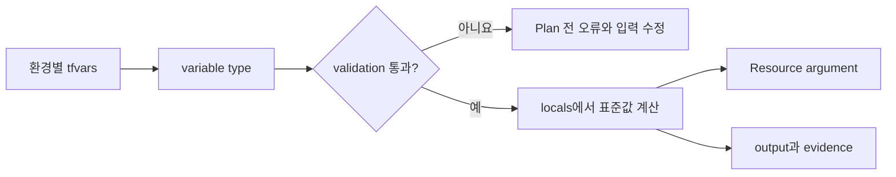

# 5교시: 타입과 표현식으로 환경 입력을 설계하기

## 실습 확인 기록

> 수업 시간이 부족하여 실습을 행하지 못했음. 추후 해보고 싶으면 강의자료를 참고해서 진행.

| 명령/확인 | 결과 |
|---|---|
| | |

### dev vs prod 비교

| 비교 항목 | dev | prod | 왜 다른가 |
|---|---|---|---|
| instance count | | | 용량 요구 |
| monitoring mode | | | 관찰 수준 |
| allowed CIDR 수 | | | 접근 경계 |
| 최종 Tag | | | 소유권·비용 분류 |

## 확인 질문 답변

| 질문 | 답변 |
|---|---|
| `sensitive = true`면 State에 값이 남지 않나요? | 아니요. `sensitive`는 CLI/Plan 출력에서 값을 가릴 뿐 State 파일에는 **평문**으로 저장됨. State 저장을 막는 약속이 아니므로 State·Plan 접근 권한을 따로 제한해야 함. 실제 Secret은 tfvars/State에 넣지 말고 비밀 저장소·짧은 수명 자격증명·CI 보호 변수로 주입. |
| set의 첫 번째 요소를 `[0]`으로 읽을 수 있나요? | 아니요. set은 **순서와 index가 없음**. index로 접근하려면 `tolist()`로 list 변환이 필요하고, 변환 시 순서가 보장되지 않으니 `sort()`로 정렬을 별도로 고려. |
| `locals`는 환경에서 값을 직접 입력받는 인터페이스인가요? | 아니요. 외부/환경 입력을 받는 건 `variable`. `locals`는 그 입력을 Module 내부에서 **표준 형태로 변환·계산**하는 내부 값이라 직접 입력받지 않음(공통 Tag, 이름 prefix, 병합 설정 등). |
| dev와 prod 차이가 크다면 tfvars만 계속 늘리는 게 좋은가요? | 차이가 **입력값 수준**이면 tfvars로 충분. 하지만 차이가 Resource 구조·권한 경계까지 벌어지면 tfvars를 늘리기보다 **별도 Root Module과 State로 분리**하는 편이 나음(Day 4로 이어짐). |

## notes

### 값에는 타입이 있다
| 분류 | 타입 | 예 | 주의점 |
|---|---|---|---|
| Primitive | `string` `number` `bool` | `"dev"` `2` `true` | 따옴표/자동 변환에 의존하지 않기 |
| Collection | `list(T)` `set(T)` `map(T)` | subnet 목록, Tag map | set은 순서·index 없음 |
| Structural | `tuple([...])` `object({...})` | 환경 설정 객체 | 각 위치/속성 타입이 계약에 포함 |
| Absence | `null` | 선택 입력 생략 | 빈 문자열과 의미 다름 |

- `""`, `[]`, `{}`, `null`은 **서로 다른 값**. `null`은 값의 부재 → optional argument는 생략처럼 처리, 필수 argument면 오류.

### object로 환경 설정을 한 계약으로
- `object({ name, instance_count, enable_monitoring, allowed_cidrs, extra_tags })`로 관련 값을 묶고, `validation { condition = contains(["dev","stage","prod"], ...) }`로 팀 규칙을 **Plan 전에** 검사.
- 흐름: `환경별 tfvars → variable type → validation → locals(표준화) → Resource / output`.

### variable · locals · output 책임
| 구성 | 질문 | 예 |
|---|---|---|
| `variable` | 호출자/환경이 무엇을 결정하나? | 환경명, CIDR, 규모 |
| `locals` | 내부에서 어떻게 표준화하나? | 공통 Tag, 이름 prefix, 병합 설정 |
| `output` | 다음 계층에 무엇을 공개하나? | VPC ID, endpoint, 확인값 |
- `merge(a, b)`는 **뒤 map(b)의 같은 key가 앞(a)을 덮음**. `ManagedBy`를 사용자가 덮게 둘지 팀 정책으로 먼저 결정.

### console에서 시험하는 표현식/함수
| 함수/표현식 | 언제 | 주의 |
|---|---|---|
| `merge` | map을 우선순위대로 결합 | 뒤 map이 같은 key를 덮음 |
| `toset`/`tolist` | 컬렉션 모양 변환 | set→list 시 정렬 별도 고려 |
| `lookup` | map key 기본값 제공 | object 필수 속성 문제를 숨기지 않기 |
| `try`/`can` | 성공 값 선택 / 평가 가능 여부 | 실제 schema 오류를 과하게 숨기지 않기 |
| 조건식 `a ? b : c` | 조건에 따라 선택 | 양쪽 결과 타입 호환 필요 |
| `jsonencode` | 정책/JSON 문자열 생성 | 문자열 이어붙이기보다 구조 먼저 |

### 환경별 입력 주입과 우선순위
| 방식 | 알맞은 사용 | 운영 주의 |
|---|---|---|
| variable default | 안전한 공통 기본값 | 운영값을 묵시적으로 만들지 않기 |
| `terraform.tfvars` | Root Module 자동 입력 | 파일명만으로 환경 불분명할 수 있음 |
| `*.auto.tfvars` | 자동 로딩 비민감 설정 | lexical order·덮어쓰기 확인 |
| `-var-file` | 환경별 파일 명시 선택 | 실행 명령·승인 evidence에 파일 기록 |
| `TF_VAR_name` | CI/CD 값 주입 | 복합 타입은 shell escaping 어려움 |
| `-var` | 일회성 override | 명령 이력에 민감값 남기지 않기 |
- CLI 명시값이 높은 우선순위. "어떤 값이 이겼나"보다 **"왜 두 출처에 같은 변수를 정의했나"**를 먼저 고치기.

### Secret 경계
- `sensitive = true`는 CLI 출력 가림일 뿐 State 저장을 막지 않음 → 실제 Secret은 tfvars에 넣지 말고 별도 경로로 주입, State/Plan 접근도 제한.

## Blocker Log

| 증상 | 확인한 것 |
|---|---|
| | |
