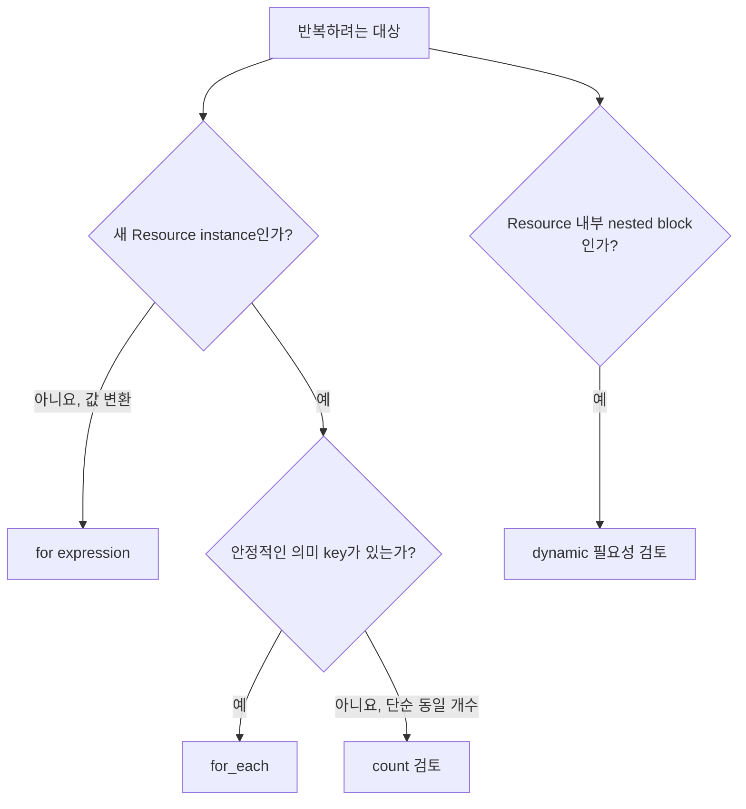

# 6교시: `for`, `for_each`, `count`로 반복을 안전하게 다루기

## 실습 확인 기록

> 추후 해보고 싶으면 강의자료를 참고해서 진행.

| 명령/확인 | 결과 |
|---|---|
| | |

### before → after (api 제거) 주소 변화 비교

| 주소 | before | after 예상 | 왜 |
|---|---|---|---|
| `terraform_data.counted[0]` | web | web | index 유지 |
| `terraform_data.counted[1]` | api | **worker로 값 변경** | 중간 삭제로 index 이동 |
| `terraform_data.counted[2]` | worker | **삭제** | 목록이 2개로 줄어듦 |
| `terraform_data.keyed["web"]` | frontend | frontend | key 유지 |
| `terraform_data.keyed["api"]` | backend | **삭제** | 해당 key만 제거 |
| `terraform_data.keyed["worker"]` | jobs | jobs | key 유지 |

→ `count`는 index가 identity라 중간 삭제가 뒤를 밀지만, `for_each`는 key가 identity라 **`api`만** 정확히 제거됨.

## 확인 질문 답변

| 질문 | 답변 |
|---|---|
| `for`를 쓰면 Resource가 여러 개 생기나요? | 아니요. `for` expression은 list/set/map **값**을 만들 뿐 Resource를 만들지 않음. Resource instance는 그 값을 `for_each`/`count` meta-argument에 넘겼을 때 생김. |
| `for_each`로 바꾸면 모든 주소가 자동 보존되나요? | 아니요. **key가 안정적일 때만** 보존됨. key 자체를 바꾸면 이전 key 삭제 + 새 key 생성으로 다른 instance가 됨. 또 `count`→`for_each` 전환 자체도 주소 형태(`[0]`→`["web"]`)가 바뀌어 그대로 두면 재생성됨(`state mv` 필요). |
| list를 `toset`으로 바꿔도 데이터 의미가 항상 같나요? | 아니요. `toset`은 **중복과 순서를 제거**함. 그게 의도한 identity인지 확인해야 함(`for_each`는 map 또는 set of strings만 받음). |
| `ignore_changes`를 쓰면 외부 변경 문제가 해결되나요? | 아니요. Plan에서 **안 보이게 할 뿐** 실제 drift를 장기간 은폐할 수 있음. 소유권 문서와 별도 관찰 수단이 있어야 함. `ignore_changes`는 drift 해결책이 아님. |

## notes

### 반복 기능은 두 종류(값 vs Resource)
| 기능 | 결과 | 예 |
|---|---|---|
| `for` expression | list/set/map **값** | Tag map 변환, ID 목록 |
| `count` | 여러 Resource/Module instance | `resource.item[0]` |
| `for_each` | key별 Resource/Module instance | `resource.item["api"]` |
| `dynamic` | Resource 안 반복 nested block | 여러 rule block |

- 판단: 값 변환이면 `for`, 새 instance면 `count`/`for_each`, nested block이면 `dynamic`.



### `for`는 값을 만든다
```hcl
subnet_names   = [for key, subnet in var.subnets : "${key}-${subnet.zone}"]
public_subnets = { for key, subnet in var.subnets : key => subnet if subnet.public }
```
- 첫 표현식은 list, 두 번째는 조건(`if`) 걸린 map. Resource가 생기는 건 이 값을 `for_each`에 넘겼을 때.

### count vs for_each 주소
| 입력 변경 | `count` 주소 | `for_each` 주소 |
|---|---|---|
| 목록 끝에 추가 | 새 마지막 index | 새 key만 추가 |
| 목록 중간 삽입/삭제 | 뒤 index 의미 이동 | 기존 key 유지 |
| 항목 이름 변경 | 같은 index 값 변경 | 이전 key 삭제 + 새 key 생성 |
| 순서만 변경 | 여러 index 값 변경 가능 | key 같으면 주소 유지 |

- `for_each`가 항상 정답은 아님. key는 표시 이름보다 **수명주기 identity**에 가깝게 설계.

### for_each 입력 모양과 좋은 key
- `for_each`는 **map 또는 set of strings**만 받고, key는 **Plan 시점에 알아야** 함(apply 후 생기는 ID는 key 불가).

| 좋은 key | 좋지 않은 key |
|---|---|
| `public-a`처럼 역할·수명 안정 | 순번 문자열 `0`, `1` |
| 팀이 변경 규칙 합의한 service ID | 자주 바뀌는 표시 이름 |
| Import 대상과 매핑 가능한 고유 이름 | apply 전 알 수 없는 Resource ID |

### dynamic block
```hcl
dynamic "ingress" {
  for_each = var.ingress_rules
  content { from_port = ingress.value.port; to_port = ingress.value.port; protocol = "tcp"; cidr_blocks = ingress.value.cidrs }
}
```
| 쓸 만한 상황 | 피할 상황 |
|---|---|
| 같은 nested block이 여러 번 필요 | argument 한두 개면 끝 |
| Module이 명확한 rule object 계약 제공 | Provider schema 그대로 복제한 범용 Module |
| 반복 구조가 공식 문서와 쉽게 대응 | 여러 단계 dynamic으로 읽기 어려움 |
- `dynamic`은 문서에 없는 block을 만들지 못함.

### lifecycle은 마지막에 검토(안전장치 아님, 변경 규칙)
| 규칙 | 이유 | 주의 |
|---|---|---|
| `create_before_destroy` | 교체 중 새 객체 먼저 준비 | 이름 충돌·동시 비용 |
| `prevent_destroy` | 실수 삭제 차단 | 정식 삭제 시 해제 필요, **백업 아님** |
| `ignore_changes` | 외부 소유 속성 제외 | drift 장기 은폐 가능 |
| `replace_triggered_by` | 관련 객체 변화에 교체 연결 | 교체 범위 검토 |

- RDS·Route53·IAM·KMS 같은 위험 민감 리소스는 이름이 아니라 **단일 소유권·데이터 복구·변경 경로** 기준으로 Resource/Import/Data Source/명시 ID 중 선택.

## Blocker Log

| 증상 | 확인한 것 |
|---|---|
| | |
